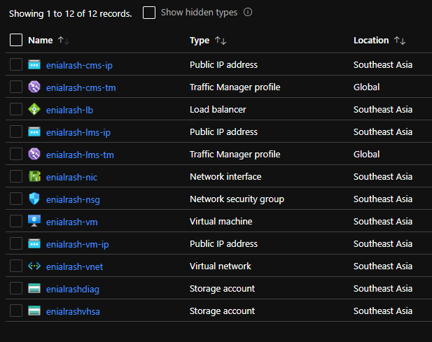

# Open EdX Deployment on Azure
This project contains an **ARM Template** and some scripts used to deploy **Open EdX** platform on Azure.

#### Prerequisites :  
- *PowerShell 5 and above*
- *AZ Module*

#### List of resources that will be deployed

#### ARM Template Visualization

## Deploy via PowerShell
**Run Deploy-ARM.ps1 in PowerShell**

    &"<Deply-ARM directory>\Deploy-ARM.ps1" `
        -AzureSubscriptionName "<Azure Subscription Name>" `
        -ResourceGroupName "<Resource Group>" `
        -Location "<Location>" `
        -AadWebClientId "<AAD Client ID>" `
        -AadWebClientAppKey "<AAD Client Key>" `
        -AadTenantId "<AAD Tenant ID>" `
        -FullDeploymentArmTemplateFile "<ARM Template File Path>" `
        -clusterName "<root name or resources>" `
        -virtualMachineSize "<Virtual Machine Size>" `
        -diskSize <Disk Size> `
        -adminUsername "<VM Username>" `
        -adminPublicKey "<VM Public Key>" `
        -cmsBaseURL "<CMS base URL>" `
        -lmsBaseURL "<LMS base URL>" `
        -installerGithubAccountName "<Installer Github account name>" `
        -installerGithubProjectName "<Installer Github project name>" `
        -installerGithubBranch "<Installer Github branch>" `
        -edxConfigurationGithubAccountName "<Configuration Github account name>" `
        -edxConfigurationGithubProjectName "<Configuration Github project name>" `
        -edxConfigurationGithubBranch "<Configuration Github branch>"
**Deploy-ARM.ps1 Parameters**
| Parameter name                        | Type  | Mandatory | Default Value                 |
|---------------------------------------|-------|-----------|-------------------------------|
|`-AzureSubscriptionName`               |string |true       |                               |
|`-ResourceGroupName`                   |string |true       |enialrash                      |
|`-Location`                            |string |true       |southeastasia                  |
|`-AadWebClientId`                      |string |true       |                               |
|`-AadWebClientAppKey`                  |string |true       |                               |
|`-AadTenantId`                         |string |true       |                               |
|`-FullDeploymentArmTemplateFile`       |string |true       |                               |
|`-clusterName`                         |string |false      |enialrash                      |
|`-virtualMachineSize`                  |string |false      |Standard_D3_v2                 |
|`-diskSize`                            |int    |false      |50                             |
|`-adminUsername`                       |string |true       |enialrash                      |
|`-adminPublicKey`                      |string |true       |                               |
|`-cmsBaseURL`                          |string |false      |studio.enialrahs.org           |
|`-lmsBaseURL`                          |string |false      |enialrahs.org                  |
|`-installerGithubAccountName`          |string |false      |enialrahs                      |
|`-installerGithubProjectName`          |string |false      |master                         |
|`-installerGithubBranch`               |string |false      |enialrahs                      |
|`-edxConfigurationGithubAccountName`   |string |false      |onecliquezone                  |
|`-edxConfigurationGithubProjectName`   |string |false      |configuration                  |
|`-edxConfigurationGithubBranch`        |string |false      |open-release/ironwood.master   |

## Deploy via Azure ARM Template
1. Clone `arm/template` branch.
2. Edit environments in `/utils/install/install-openedx.sh`.

        export OPENEDX_RELEASE=open-release/ironwood.master
        export EDX_CONFIGURATION_PUBLIC_GITHUB_ACCOUNTNAME=edx
        export EDX_CONFIGURATION_PUBLIC_GITHUB_PROJECTNAME=configuration
        export EDXAPP_LMS_BASE=enialrash.org
        export EDXAPP_CMS_BASE=studio.enialrash.org
|Environment Name                           |Default Value                  |
|-------------------------------------------|-------------------------------|
|OPENEDX_RELEASE                            |open-release/ironwood.master   |
|EDX_CONFIGURATION_PUBLIC_GITHUB_ACCOUNTNAME|edx                            |
|EDX_CONFIGURATION_PUBLIC_GITHUB_PROJECTNAME|configuration                  |
|EDXAPP_LMS_BASE                            |enialrash.org                  |
|EDXAPP_CMS_BASE                            |studio.enialrash.org           |

1. [Deploy ARM Template][deployarmtemplate]
2. Click Build your own template in the editor
3. Upload `template.json` file and save.
4. Upload `parameters.json` file and save.
5. Fill/Change the value of parameters.

**Check out Azure Virtual Machines Sizes [here][vmsizes].**

**Check out Open EdX Releases [here][edxreleases].**

Deployment of azure resources takes a minute to complete.  
Open EdX installation takes almost 2 hours to finished.  
To check the status of installation
1. Login to Virtual Machine via ssh
2. Execute the following command
   
        sudo su
        cd ~
        tail -f install.out
3. After the installation is finished check out the URL of CMS and LMS 
    >**CMS**: `http://<clustername>-cms-tm.trafficmanager.net` 
    >**LMS**: `http://<clustername>-lms-tm.trafficmanager.net`

[//]: # (These are reference links)

   [vmsizes]: <https://docs.microsoft.com/en-us/azure/virtual-machines/sizes-general?toc=/azure/virtual-machines/linux/toc.json&bc=/azure/virtual-machines/linux/breadcrumb/toc.json>
   [deployarmtemplate]: <https://portal.azure.com/#create/Microsoft.Template>
   [edxreleases]: <https://edx.readthedocs.io/projects/edx-developer-docs/en/latest/named_releases.html>